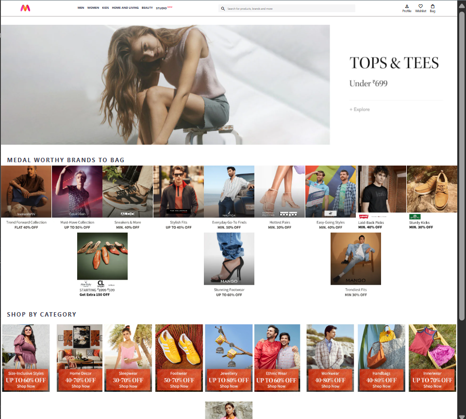

# Myntra Clone

A front-end clone of the Myntra homepage, built to practice real-world layout techniques using HTML and CSS.

🔗 **Live Demo:** [https://fizza-khatoon.github.io/myntra-clone/](https://fizza-khatoon.github.io/myntra-clone/)

## Preview



## Features

- Responsive header with logo, navigation bar, search bar, and action icons (Profile, Wishlist, Bag)
- Hover effects on navigation links
- Banner section
- "Medal Worthy Brands" horizontal scroll/wrap section with sale item images
- "Shop by Category" grid-style section
- Multi-column footer with quick links and copyright bar

## Tech Stack

- **HTML5** — semantic structure
- **CSS3** — Flexbox for layout (header, nav bar, search bar, action bar, category items, and footer columns)
- **Material Symbols** — icon font for search, profile, wishlist, and bag icons

## Project Structure

```
myntra-clone/
├── index.html
├── index.css
├── screenshot.png
├── images/
│   ├── myntra_logo.webp
│   ├── banner.jpg
│   ├── offers/
│   │   └── 1.png ... 12.png
│   └── categories/
│       └── 1 (1).jpg ... 10.jpg
└── README.md
```

## Running Locally

1. Clone the repo
   ```bash
   git clone https://github.com/fizza-khatoon/myntra-clone.git
   ```
2. Open `index.html` in your browser — no build step or dependencies required.

## What I Learned

- Structuring a multi-section page with semantic HTML
- Using Flexbox for real layout problems: space-between/space-evenly alignment, wrapping item grids, and column layouts in the footer
- Working with external icon fonts
- Organizing image assets for a content-heavy page

## Notes

This is a static front-end clone built for learning purposes and is not affiliated with or endorsed by Myntra. All product/category images are used for practice only.

## Author

**Fizza Khatoon**
MCA Student
[GitHub](https://github.com/fizza-khatoon) · [LinkedIn](https://linkedin.com/in/fizza-khatoon)
